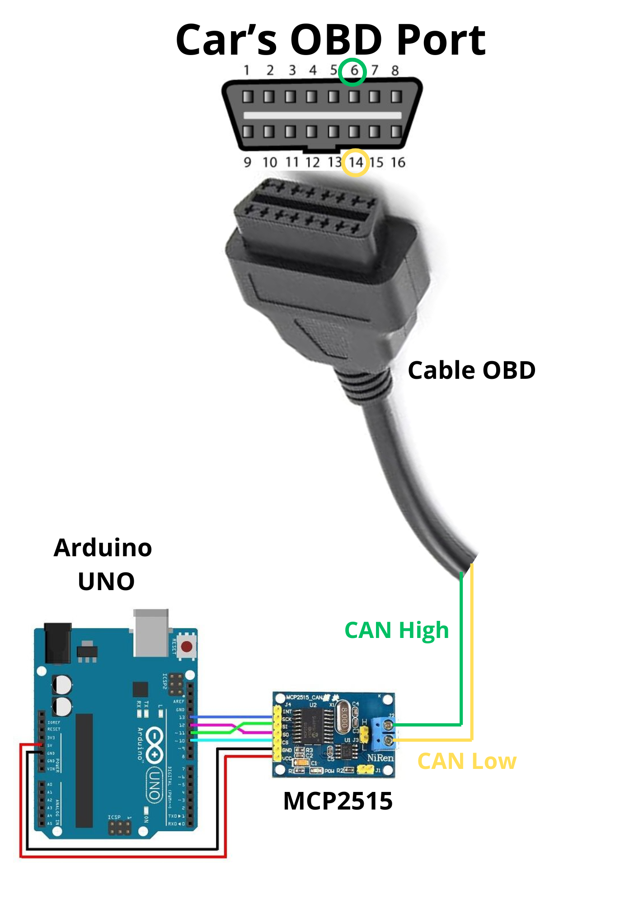
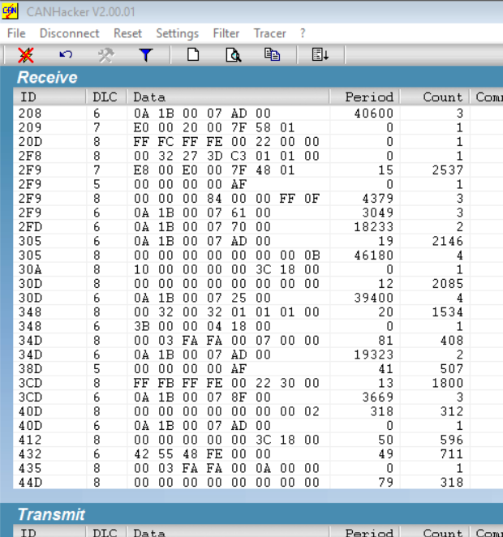

# 🚗 CAN BUS reader with Arduino UNO for real Cars

## 📌 Key Points

- I aimed to read and analyze real automotive CAN bus data to understand vehicle communication systems
- The task was to Ensure reliable communication between the vehicle’s CAN network and a computer interface for data visualization
- Used an OBD-II cable to safely access the car’s CAN High and CAN Low lines by using an Arduino UNO and a MCP2515 transceiver
- Successfully captured and displayed real-time CAN bus data from a running vehicle on a computer via CANHacker interface

